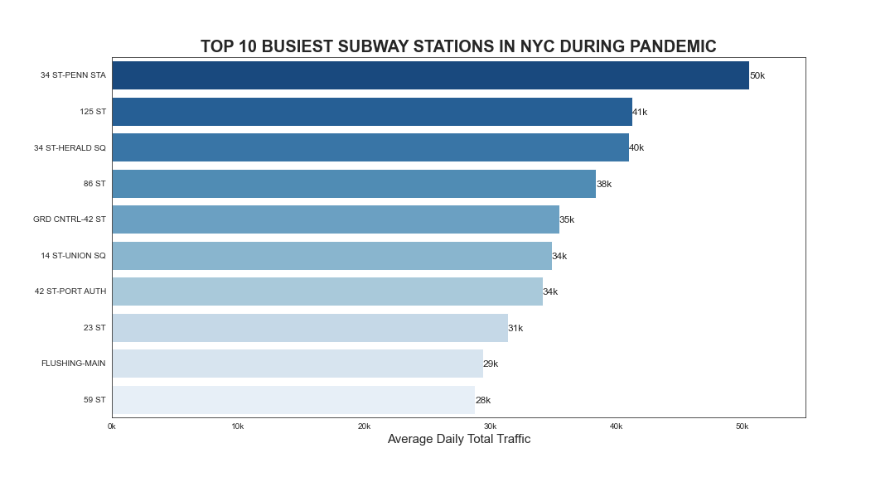
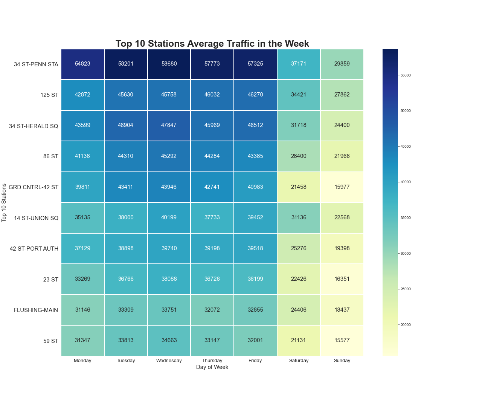

# MVP

I did an Exploratory Data Analysis on the MTA turnstile Data during pandemic (from week of 4/11/20 to 03/20/21) and created data visualizations to answer the following questions for the station accessibility upgrade:

- What are the ten most busiest subway stations during pandemic?

The top 10 stations with heaviest traffic in NYC during pandemic are shown as following:

* What day of the week would be the least traffic in the ten most busiest subway stations during pandemic?

The average traffic trend in the week for the top 10 stations shows that the weekends have lower traffic than the weekdays. 

The results suggested the ridership is lower on the weekends in the top ten busiest stations. It can be a good option for the construction company to schedule work during those times to avoid crowdiness during pandemic.
